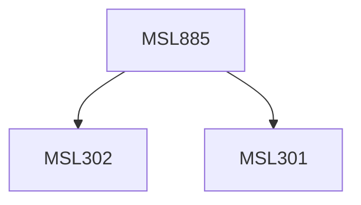

**Credits:** 3 (3-0-0)

**Prerequisites:** [[/Management Studies/MSL301|MSL301]] & [[/Management Studies/MSL302|MSL302]]

#### Description
The course may cover the following topics: Introduction and Perspectives in internet marketing, Online consumer behaviour and technology adoption theories, Managing the Word of Web, Mapping online communities & networks, Online pricing mechanisms, Social Network Analytics & Optimization, Web Analytics and Optimization, Traffic analytics, Online campaign and channel management, Managing the Web 2.0, Search Engine & Social Media Optimization, SMAC, Social CRMs, Metrics for E-Commerce Analytics, KPIs, Revenue Analytics.

### Prerequisite Tree

