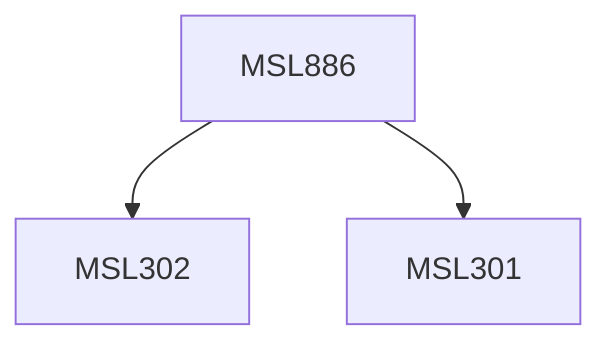

**Credits:** 3 (3-0-0)

**Prerequisites:** [[/Management Studies/MSL301|MSL301]] & [[/Management Studies/MSL302|MSL302]]

#### Description
This course may expose the participants to the following topics: Trends in the IT consulting industry, IT consulting issues and pain points, Critical IT issues and their organizational contexts, Marketing and selling IT consulting projects, Project Entry Strategies, Contracting, Proposal Writing and making the sales pitch, Frameworks for technology evaluation. Frameworks for consulting intervention, change management and project closure,Implementation Planning for IT Projects, Managing Consulting Firms and Knowledge Management. Other relevant topics may also be explored.

### Prerequisite Tree

