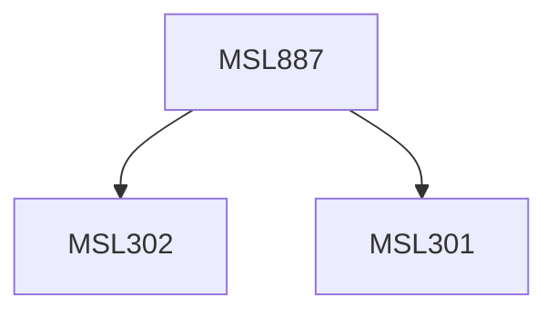

**Credits:** 3 (3-0-0)

**Prerequisites:** [[/Management Studies/MSL301|MSL301]] & [[/Management Studies/MSL302|MSL302]]

#### Description
This course may expose the participants to the following topics: Introduction to Ubiquitous computing, Mobile communication and emerging technologies, Ubiquitous business models and challenges, Security issues and information risk management in mobile commerce. Mobile services and location based services, Interface with Social Media and Cloud, Mobile banking and payment systems, Socio-economic development with m-Commerce, Mobile based services for e-governance. Introduction to mobile apps in the context of ICT ecosystem; explaining success of apps; app entrepreneurship; app economy, challenges of entrepreneurship and economy. Business models of app stores; mobile gaming; app customer segmentation; case studies.

### Prerequisite Tree

