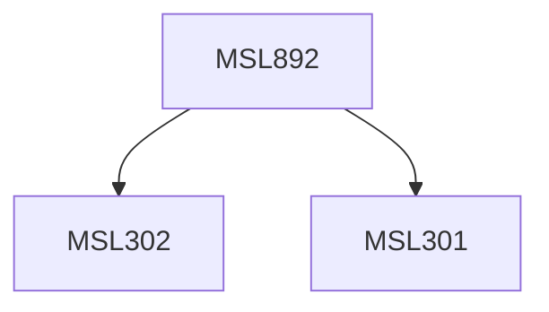

**Credits:** 1.5 (1.5-0-0)

**Prerequisites:** [[/Management Studies/MSL301|MSL301]] & [[/Management Studies/MSL302|MSL302]]

#### Description
This course may expose the participants to the following topics: Introduction to the different predictive analytics models, using Predictive Analytics in decision making, types of Predictive Modeling, Agent Modeling, Case Based Reasoning and Predictive Expert Systems. Text mining, Social Network Analytics, Heuristics, Swarm algorithms, Hybrid Methods and algorithms. Other relevant topics within the subject domain may also be explored.

### Prerequisite Tree

