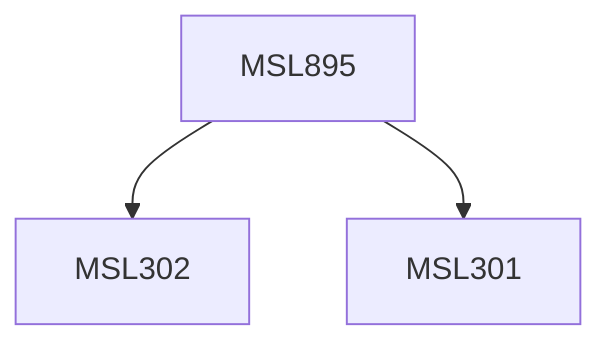

**Credits:** 3 (3-0-0)

**Prerequisites:** [[/Management Studies/MSL301|MSL301]] & [[/Management Studies/MSL302|MSL302]]

#### Description
Module I: Descriptive vs. Inferential Analysis, Parametric vs. Nanoparametric Analysis, Univariate, Bivariate and multivariate analysis, Hypothesis Testing and Estimation Module II: ANCOVA, MANOVA, Logit Regression, Tobbit Regression, Panel Regression.

Module III: Factor Analysis, Cluster Analysis, Discriminant Analysis, Data Envelopment Analysis, Structural Equation Modelling.

### Prerequisite Tree

