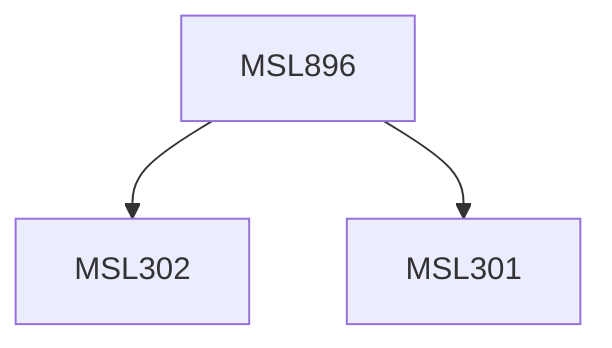

**Credits:** 3 (3-0-0)

**Prerequisites:** [[/Management Studies/MSL301|MSL301]] & [[/Management Studies/MSL302|MSL302]]

#### Description
World trade; The standard trade model; economies of scale and international trade; international factor movements; instruments of trade policy; exchange rates and foreign exchange markets; money, interest rates and exchange rates; price, output and exchange rates, different exchange rate regimes and policy, optimum currency area; Global capital markets; Financial crisis and contagion, Transition economies: crisis and reform.

### Prerequisite Tree

