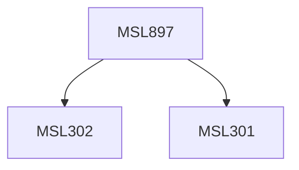

**Credits:** 3 (3-0-0)

**Prerequisites:** [[/Management Studies/MSL301|MSL301]] & [[/Management Studies/MSL302|MSL302]]

#### Description
Module I: Introduction to Consultancy-its evolution, growth & status, Types of Consulting Services, firms and role of consultants, client- consultant relationship. Marketing of Consultancy Services.

Module II: The Consulting Process-Entry, Diagnosis, Action Planning, Implementation and Termination/Closing;

Module III: Methods of selection of consultants, Costs and fee calculation, Preparation of Consultancy proposals and Agreements, Technical Report Writing and Presentation.

### Prerequisite Tree

