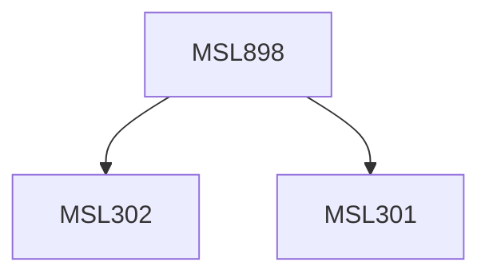

**Credits:** 3 (3-0-0)

**Prerequisites:** [[/Management Studies/MSL301|MSL301]] & [[/Management Studies/MSL302|MSL302]]

#### Description
Module I: Negotiation Skills, Professional Ethics and Code of Conduct. Managing a Consultancy firm-fundamentals of consulting firm management, consulting firms and IT in consulting firms, management of consulting assignments.

Module II: Consulting in various areas of Management-Consulting in general and strategic management, consulting in financial management, consulting in marketing and distribution management, consulting in production and operation management, consulting in HRM, consulting in IT.

Module III: R&D-Consultancy relation-ship, Careers and Compensation in Consulting, Training and development of Consultants, Future Challenges and Opportunities in Consultancy.

### Prerequisite Tree

