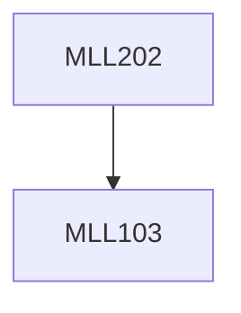

**Credits:** 3 (2-1-0)

**Prerequisites:** [[/Materials Science and Engineering/MLL103|MLL103]]

**Overlaps with:** MLL713

#### Description
Equilibrium, Phase rule, Single and multicomponent system: Gibbs Free energy as a function of temperature, ideal solutions, chemical potential, regular solutions, activity; Equilibrium in heterogeneous systems: Binary phase diagrams, systems with miscibility gap, ordered alloys, the effect of temperature on solid solubility, the kinetics of phase transformations; TTT diagram of steel, shape memory diagram, phase diagram of ceramic system (Al2O3-SiO2) and MgO-Al2O3. Ternary phase diagram, Diffusion: Atomistic mechanism, interstitial diffusions, steady state and non-steady state (Fick’s Law), spinodal decomposition, crystal interfaces and microstructure, interfacial energy, solid/vapor interfaces; Solidification: nucleation and growth in pure metals.

### Prerequisite Tree

