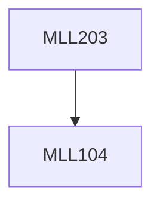

**Credits:** 3 (3-0-0)

**Prerequisites:** [[/Materials Science and Engineering/MLL104|MLL104]]

#### Description
Transmission Electron Microscope (TEM): Working principle of TEM. Image formation, resolving power, magnification, depth of focus, important lens defects and their correction. Selected area diffraction patterns, reciprocal lattice and Ewald sphere construction, sample preparation, compositional analysis. Electron energy loss spectroscopy (EELS) in TEM.

Auger electron spectroscopy (AES): Principle of AES. The mechanism of the Auger process. Source of electrons.

X-ray photoelectron spectroscopy (XPS): Physical basis of XPS

method and the experimental technique. Basic laws of XPS spectra. X-Ray semi-quantitative analysis. Practical application of the method XPS, Comparative characteristics of AES and XPS.

Secondary ion mass spectrometry (SIMS): Secondary ion emission. Qualitative and quantitative analysis, Bulk doping, Practical application of SIMS.

### Prerequisite Tree

