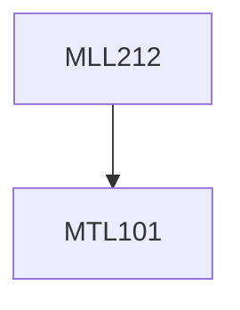

**Credits:** 3 (2-1-0)

**Prerequisites:** [[/Mathematics/MTL101|MTL101]]

#### Description
Vector Calculus: Gradient, Divergence and Curl, Physical interpretation, Laplacian.

Calculus of variations: Euler equations, Lagrangian multipliers, Variations with constraints.

Tensor analysis: Contraction, Quotient rule, Pseudotensors, Dual tensors, Tensor properties of crystals: Equilibrium and transport properties.

Group theory: Applications to crystal symmetry and point groups, Representation theory, Character tables.

Fourier Analysis: Fourier Series, Approximation by Trigonometric Polynomials, Fourier Cosine and Sine Transforms, Fourier Transform. Discrete and Fast Fourier Transforms.

Partial Differential Equations (PDEs): Basic Concepts of PDEs, solution by separating Variables, Heat equation and application to heat Flow from a body in Space, Solution by Fourier Series, Steady Two-Dimensional Heat Problems.

### Prerequisite Tree

