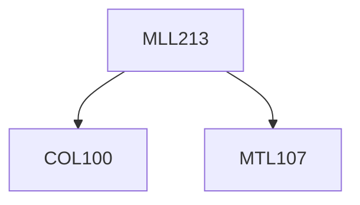

**Credits:** 3 (1-0-4)

**Prerequisites:** [[/Computer Science and Engineering/COL100|COL100]], [[/Mathematics/MTL107|MTL107]]

#### Description
Data analysis and data acquisition, Finite element difference and finite element methods, Applications to structure, thermodynamics and phase transformations.

Monte-carlo simulations and integration: Random walk model, Metropolis algorithm,, Examples of the Monte Carlo Method in Materials Science.

Molecular Dynamics: State Variables or Dependent Variables, Equations of State, Models of Interatomic Potentials, Equations of Motion and integration of the Equations of Motion, Linear and Non- linear regression, Introduction to Machine learning.

### Prerequisite Tree

