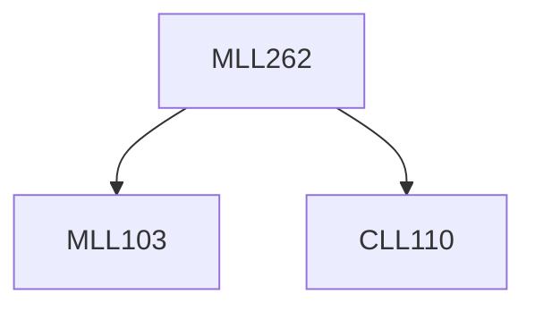

**Credits:** 4 (3-1-0)

**Prerequisites:** [[/Chemical Engineering/CLL110|CLL110]], [[/Materials Science and Engineering/MLL103|MLL103]]

#### Description
Materials and heat balance, Application of Thermodynamics, Mineral beneficiation processes. Iron making. Steel making. Al production. Hydrometallurgy.

### Prerequisite Tree

