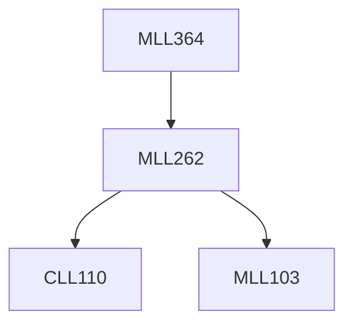

**Credits:** 3 (2-0-2)

**Prerequisites:** [[/Materials Science and Engineering/MLL262|MLL262]]

**Overlaps with:** MCL135, MCL778

#### Description
Fundamentals: Fusion and Solid-State Welding, Energy Sources, Arc Characteristics, Metal Transfer, Physical Properties of Metals and Shielding Gases. Heat Flow in Welding, Quantitative Calculation of Heat Transfer, HAZ width, Residual Stress and Distortion.

ARC Welding Processes: Power Sources, Principles of Operation, Volt-Ampere Characteristics. Fusion Welding Processes: SMAW, GTAW, GMAW, FCAW, SAW, Stud AW: Fundamentals, Equipment, and filler metal classifications, Materials weldablility, Applications, Welding Variables, Weld Quality, Process Variations; Other Welding Processes.

Welding Metallurgy: Phase transformations- weld CCT diagrams - carbon equivalent-preheating and post heating; Welding of steels - use of Schaffler and Delong diagrams, Cast irons & Non-ferrous alloys: Metallurgical Difficulties, Process selection, Filler metal selection, safe welding procedures.

Tests, Qualifications and Safety: Overview of Weld Discontinuities, Weldability, Mechanical tests. WPS, PQR and WPQ. Safety in Welding.

### Prerequisite Tree

