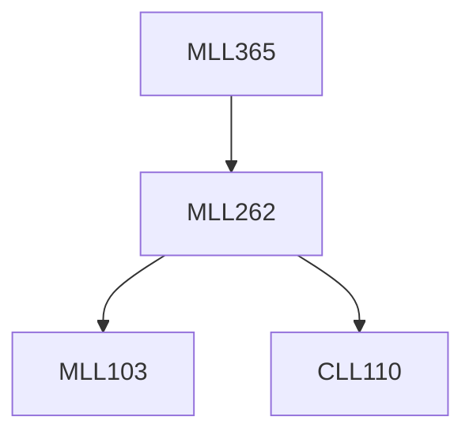

**Credits:** 3 (3-0-0)

**Prerequisites:** [[/Materials Science and Engineering/MLL262|MLL262]]

**Overlaps with:** MCL133

#### Description
Introduction – Historical background, important steps in powder metallurgy (P/M) process – Advantage and Limitations and Applications.

Methods – Production of ceramic powders, automation, rapid solidification technique. Characteristics: sampling – chemical composition, particle shape and size analysis, Surface area, packing and flow characteristics, Porosity and density, compressibility, Strength properties. Blending and mixing of metal powders; Compaction of powders, pressure less and pressure compaction techniques, Hot temperature compaction – Uni-axial hot pressing, Hot extrusion, Spark sintering, Hot isostatic pressing, Injection moulding – Sintering: Types, Theory, process variables, Effects, atmospheres, metallographic technique for sintered products.

Post sintering operations; Products: Porous parts, sintered carbides, cermets, dispersion strengthened materials, electrical applications, sintered friction materials.

Atomization, Mechanical alloying, Metal Injection moulding, Microwave sintering and self propagating high temperature synthesis.

### Prerequisite Tree

