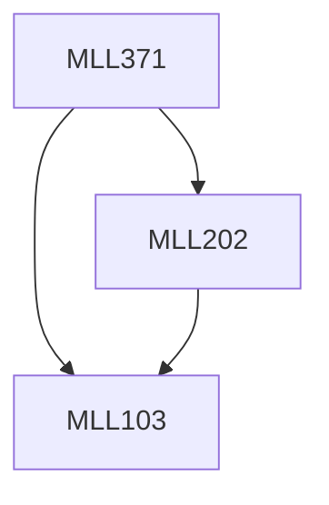

**Credits:** 3 (2-0-2)

**Prerequisites:** [[/Materials Science and Engineering/MLL103|MLL103]], [[/Materials Science and Engineering/MLL202|MLL202]]

**Overlaps with:** MCL131

#### Description
Introduction to primary processing of materials: Solidification in metals (casting process and defects), powder processing for metals and ceramics (sintering techniques and compaction) and Moulding processes for polymers (Compounding and injection, blow and compression processes). Microstructure processing; Specific processing or case studies: Ironmaking, steelmaking; non-ferrous metals; Thermoset and thermoplastic polymers; Alumina and Zirconia processing.

Introduction to secondary processing in materials: Machining and Mechanical working (Rolling, Forging, extrusion, sheet metal forming etc.,); Heat treatment; Joining (Soldering, Brazing, Adhesives, Fasteners and Welding) processes.

Introduction to surface finishing processes: Electrolytic- polishing and plating, and spray coating (Plasma spray coating processes), paint finish; surface hardening treatments.

Introduction to Special processes: Thin-film and semiconductor processing: PVD and CVD processes, single crystal growth (vapour phase transport, Czochralski, Bridgman); Rapid prototyping processes (additive manufacturing including typical 3D printing techniques like extrusion melting, selective laser melting/sintering, e-beam melting and droplet ejection).

### Prerequisite Tree

