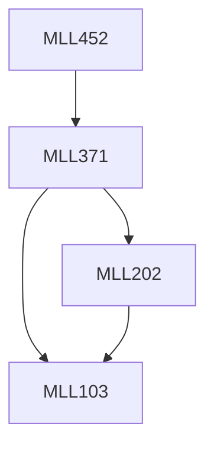

**Credits:** 4 (3-0-2)

**Prerequisites:** [[/Materials Science and Engineering/MLL371|MLL371]]

#### Description
Introduction to corrosion and degradation of materials. Electrochemical thermodynamics and kinetics of corrosion. Passivity. Corrosion related failures and types of corrosion (Uniform, Galvanic, Crevice corrosion, Pitting, Intergranular, Dealloying, Erosion, Cavitation, Fretting, Corrosion cracking, Corrosion fatigue, and Microbiological corrosion). Elevated temperature corrosion (oxidation, creep, thermal fatigue, metallurgical instabilities). Thermodynamics and kinetics of oxidation. Environmental degradation of engineering materials including glass, polymers, ceramics and composites. Corrosion prevention (cathodic protection, coatings and inhibitors).

### Prerequisite Tree

