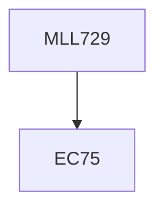

**Credits:** 3 (3-0-0)

**Prerequisites:** EC75

#### Description
Course contents: The course will cover definition and classification of blends and composites. Thermodynamics and phase behaviour of polymer blends, compatibilization strategies, nature of polymer matrices, reinforcements, basic theoretical models to predict mechanical properties and the role of fibre length, distribution, dispersion etc. on the performance properties of polymer-based blends and composites.

### Prerequisite Tree

