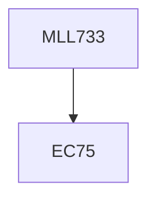

**Credits:** 3 (3-0-0)

**Prerequisites:** EC75

#### Description
Course covers reaction kinectics in condensation and all types of addition polymerisation reactions, prediction of molecular weight for polymerisation in different types of reactors, batch and continuous processes, the effect of mixing on kinetics and MWD, reactor design.

### Prerequisite Tree

