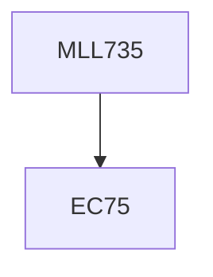

**Credits:** 3 (2-0-2)

**Prerequisites:** EC75

#### Description
Course covers the types of moulds and dies, product and mould design, details of construction and manufacturing methods of tools, dies and moulds.

### Prerequisite Tree

