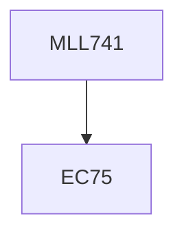

**Credits:** 3 (3-0-0)

**Prerequisites:** EC75

#### Description
Concept of biodegradation; mechanism of biodegradation; kinetics of biodegradation; methods to evaluate biodegradation; bioplastics, biodegradable polymers and their synthesis; biodegradable polymer blends and composites; technology and processing of biodegradable polymers; applications of biodegradable polymers.

### Prerequisite Tree

