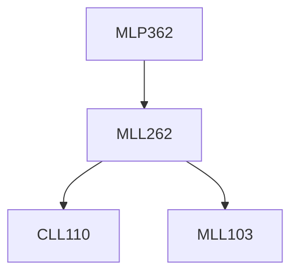

**Credits:** 2 (0-0-4)

**Prerequisites:** [[/Materials Science and Engineering/MLL262|MLL262]]

#### Description
Sample preparation procedure for metallographic observation: Sample machining and mounting, Mechanical polishing, chemical polishing, electrolytic polishing, Etchants selection and Etching procedure (macro etching, electrolytic etching, chemical etching); Study of metallurgical microscope.

Microstructure observation in optical microscope: Microstructure of various ferrous (for example: cast iron, iron, carbon steels, stainless steels, over heated and banded structures etc.,) and non-ferrous (Cu-, Al-, Pb-, Mg-, Ti-and Ni-alloys) metal grades.

Microstructure interpretation and analysis: Grain size measurements (line-intercept-, ASTM grain size-, digital images based-methods), particle or precipitate size, fraction and distribution analysis. In situ metallography practice.

### Prerequisite Tree

