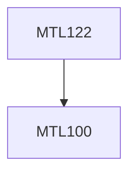

**Credits:** 4 (3-1-0)

**Prerequisites:** [[/Mathematics/MTL100|MTL100]]

**Overlaps with:** MTL503, MTL506

#### Description
Metric spaces: Definition and examples. Open, closed and bounded sets. Interior, closure and boundary. Convergence and completeness. Continuity and uniform continuity. Connectedness, compactness and separability. Heine-Borel theorem. Pointwise and uniform convergence of real-valued functions. Equicontinuity. Ascoli-Arzela theorem. Limits, continuity and differentiability of functions of a complex variable. Analytic functions, the Cauchy-Riemann equations. Definition of contour integrals, Cauchy’s integral formula and derivatives of analytic functions. Morera’s and Liouville’s theorems. Maximum modulus principle. Taylor and Laurent series. Isolated singular points and residues. Cauchy’s residue theorem and applications.

### Prerequisite Tree

