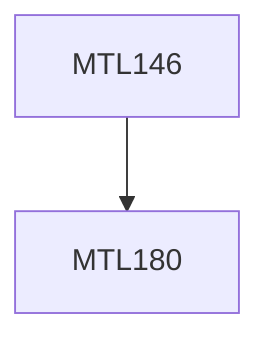

**Credits:** 3 (3-0-0)

**Prerequisites:** [[/Mathematics/MTL180|MTL180]]

#### Description
Basic counting techniques; principle of inclusion and exclusion; recurrences and generating functions; Systems of Distinct Representatives & Hall’s theorem; Extremal Set theory; Projective and combinatorial geometries; Latin squares; Designs & Steiner Triple Systems; Ramsey theory.

### Prerequisite Tree

