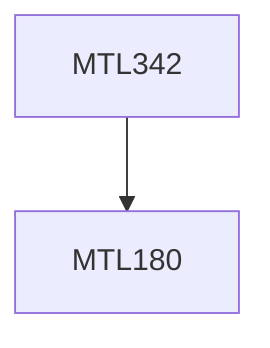

**Credits:** 4 (3-1-0)

**Prerequisites:** [[/Mathematics/MTL180|MTL180]]

**Overlaps with:** COL351

#### Description
Models of computation: RAM and Turing Machines; Algorithm Analysis techniques; Basic techniques for designing algorithms: dynamic programming, divide-and-conquer and Greedy; DFS , BFS and their applications; Some Basic Graph Algorithms; linear time sorting algorithms; NP-Completeness and Approximation Algorithms.

### Prerequisite Tree

