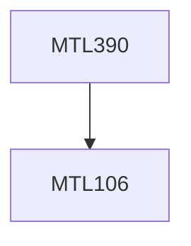

**Credits:** 4 (3-1-0)

**Prerequisites:** [[/Mathematics/MTL106|MTL106]]

**Overlaps with:** MTL108

#### Description
Basic concepts and Data Visualization: Measures of central tendency, Dispersion, Skewness, Kurtosis, Data Representation using Histogram, Pie Chart, Boxplot, Biplot, Multi Dimensional Scaling etc. Revision of Probability Distribution: Emphasis on Normal, Chi-Square, Student’s T, F distributions; Order Statistics: Different Order Statistics and their single and joint Distribution; Sampling Distribution of Mean, Variance; Generation of Random Numbers following certain distributions; Theory of Estimation (Point and Interval)Properties of an estimator, MVUE, BLUE, Cramer-Rao Inequality, Rao-Blackwell Theorem; Testing of Hypothesis: Mean and Variance, Confidence Interval, Neyman- Pearson Lemma; Non-Parametric Methods Run Tests, Rank Tests, Signed Rank Tests, Kruskal Wallis Test, Kolmogorov-Smirnov Test etc.; Regression Analysis Linear Regression, Multiple Regression, Logit, Probit, Regression.

### Prerequisite Tree

