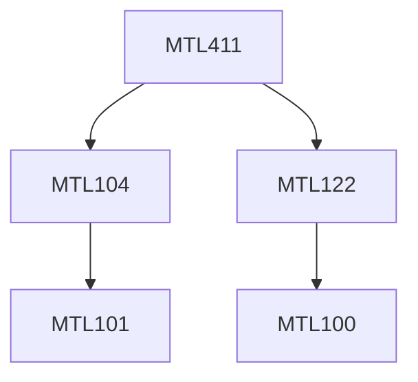

**Credits:** 3 (3-0-0)

**Prerequisites:** [[/Mathematics/MTL104 | MTL104]] and [[/Mathematics/MTL122 | MTL122]]

**Overlaps with:** MTL602

#### Description 
Review of some basic concepts in metric spaces and topological spaces; Normed linear spaces and Banach spaces, Examples of Banach spaces, Bounded linear operators and examples, Finite dimensional Banach spaces; Introduction of Lebesgue integration on real line, Fatou’s lemma, monotone convergence theorem, dominated convergence theorem, Lp spaces; Hahn Banach extension theorem, Hahn Banach separation theorem, Uniform boundedness principle, Open mapping theorem, Closed graph theorem; Characterization of dual of certain concrete Banach spaces; Schauder basis and separability, Reflexive Banach spaces, Best approximation in Banach spaces; Hilbert spaces and their geometry; Basic operator theory.

### Prerequisite Tree

