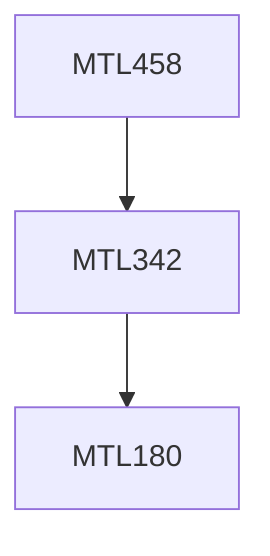

**Credits:** 4 (3-0-2)

**Prerequisites:** [[/Mathematics/MTL342|MTL342]]

**Overlaps with:** COL331, ELL405

#### Description
Operating Systems functions, Basic Concepts, Notion of a process, concurrent processes, problem of mutual exclusion, Deadlock, process Scheduling, memory management, multiprogramming, File systems; time sharing systems and their design consideration.

### Prerequisite Tree

