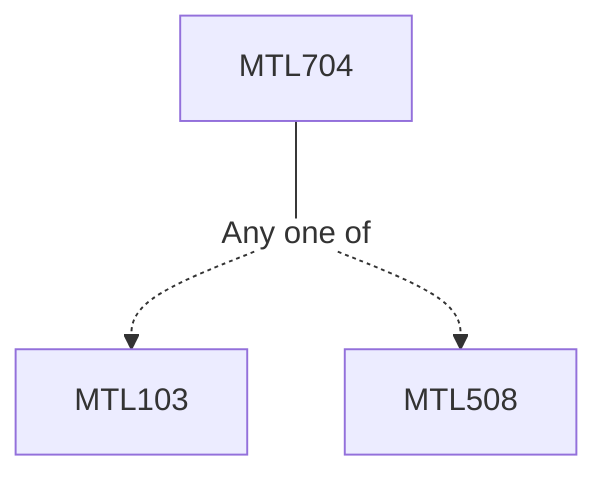

**Credits:** 3 (3-0-0)

**Prerequisites:** [[/Mathematics/MTL103|MTL103]]/[[/Mathematics/MTL508|MTL508]]

#### Description
Unconstrained optimization techniques - one dimensional methods like Fibonacci method, Golden section method; higher dimension methods:

pattern search method, Nelder and Meed method; gradient based methods: Steepest descent method, Newton method, Conjugate direction and gradient method, Quasi-Newton methods. Constrained optimization techniques - penalty method, barrier method, cutting plane method, projection gradient method. Heuristic technique: like Genetic programming method to solve non-convex programs.

### Prerequisite Tree

