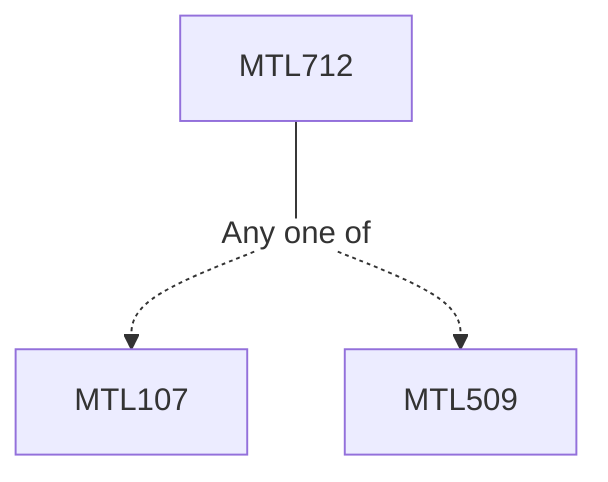

**Credits:** 4 (3-0-2)

**Prerequisites:** [[/Mathematics/MTL107|MTL107]]/[[/Mathematics/MTL509|MTL509]]

#### Description
Numerical methods for solving IVPs for ODEs: Difference equations, Routh-Hurwitz criterion, Test Equation. Single step methods: Taylor series method, explicit Runge-Kutta methods, convergence, order, relative and absolute stability. Multistep methods: Development of linear multistep method using interpolation and undetermined parameter approach, convergence, order, relative and absolute stability, Predictor Corrector methods. Solution of initial value problems of systems of ODES. BVP: Finite difference methods for second order ODEs, Eigenvalue problems.

PDEs: Finite difference methods for Elliptic PDEs, Consistency, stability and convergnce. Boundary Conditions. FD methods for Parabolic equations in 1D and 2D. Operator splitting methods, Convergence, stability and consistency of difference methods. Higher order methods. Introduction to Hyperbolic PDEs, FD methods. Upwind schemes, Consistency, stability and convergence of schemes. Second order schemes.

### Prerequisite Tree

