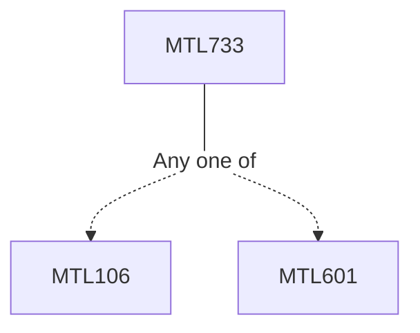

**Credits:** 3 (3-0-0)

**Prerequisites:** [[/Mathematics/MTL106|MTL106]]/[[/Mathematics/MTL601|MTL601]]

#### Description
Stochastic Processes; Brownian and Geometric Brownian Motion; Levy Processes, Jump-Diffusion Processes; Conditional Expectations and Martingales; Ito Integrals, Ito’s Formula; Stochastic Differential Equations; Change of Measure, Girsanov Theorem, Martingale Representation Theorem and Feymann-Kac Theorem; Applications of Stochastic Calculus in Finance, Option Pricing, Interest Rate Derivatives, Levy Processes in Credit Risk.

### Prerequisite Tree

