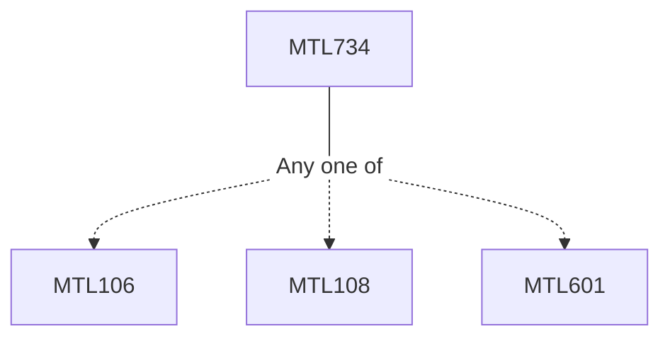

**Credits:** 3 (3-0-0)

**Prerequisites:** [[/Mathematics/MTL106|MTL106]] (Probability and Stochastic Process)/ [[/Mathematics/MTL108|MTL108]] (Introduction to Statistics)/ [[/Mathematics/MTL601|MTL601]] (Probability and Statistics)

#### Description
Random variables, probability density functions, insurance contract, nominal and effective interest rates, force of mortality, mortality expectations, transition probability using two states model, life tables, various types of life insurance products, annuity, premium net premium reserves, policy reserves, appropriateness and quantity of insurance, policy pricing, Thiele’s differential equation and its numerical solution, negative policy values, comparing two insurance policies; multiple life insurance, joint life insurance, survival and disability benefits, Kolmogorov’s forward equations and solution, Schuette-Nesbitt formula,; population theory, Lexi diagram, pension and group insurance, other types of insurances like health, property, vehicle; interest rate model, yield curve, equity linked insurance, stochastic pricing, stochastic reserving, quantile reserving. The study involves deterministic models in discrete framework (except the last part).

### Prerequisite Tree

