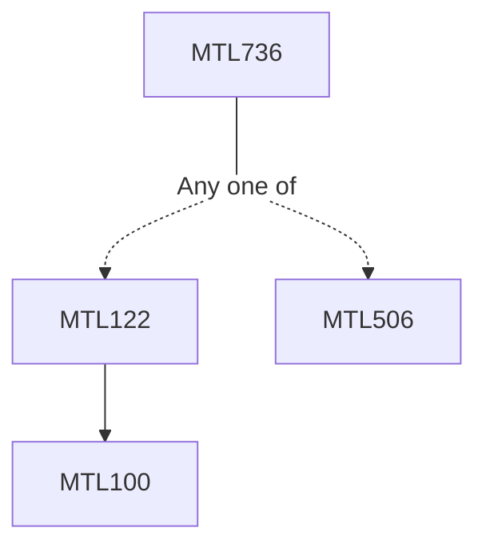

**Credits:** 3 (3-0-0)

**Prerequisites:** MTLI22 or [[/Mathematics/MTL506 | MTL506]]

#### Description 
Fundamental Theorem of Arithmetic, Arithmetic functions, Order and average order of arithmetic functions, Partial summation formula, Dirichlet's hyperbola method, Dirichlet convolution, Partial sums of Dirichlet convolution, Statement of Prime Number Theorem and its equivalent formulations, Chebyshev's Theorem, Bertrand's postulate.

Dirichlet series, Half plane of convergence and absolute convergence, Euler product, Riemann zeta function and its analytic continuation via Riemann's functional equation, Non-vanishing of Riemann zeta function on the line Re(s)=1, Proof of Prime Number Theorem, Dirichlet L-function and its analytic continuation, non-vanishing at s=1, Proof of Dirichlet's theorem for primes in arithmetic progression.

Modular group and its action on the upper half plane, Modular forms, Eisenstein series, Cusp forms, Valence formula, j-function, Hecke operators and their eigenvalues.

### Prerequisite Tree

