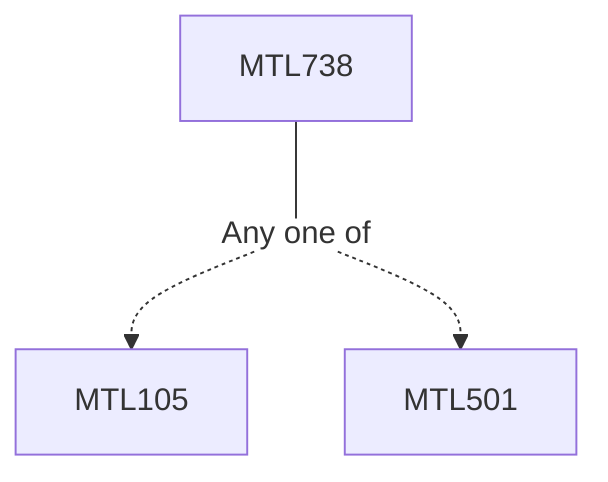

**Credits:** 3 (3-0-0)

**Prerequisites:** [[/Mathematics/MTL105|MTL105]]/[[/Mathematics/MTL501|MTL501]]

#### Description
Revision of Rings and Ideals: Prime and maximal ideals. Chinese remainder theorem, Nilradical, Jacobson radical, operations on ideals, extension and contraction; Module, submodule, quotient module, sums and products, Nakayama’s lemma; Homomorphism, kernel, cokernel, direct sum, direct product, universal properties, free module, exact sequences, tensor product of modules and its exactness property; Rings and modules of fractions and functorial properties of fractions; Primary decomposition; Integral dependence, going-up and going down theorems, valuation rings; Chain conditions, Noetherian rings, Artinian rings, discrete valuation ring and Dedikind domains, fractional ideals; Completion: filtration, graded rings and modules.

### Prerequisite Tree

