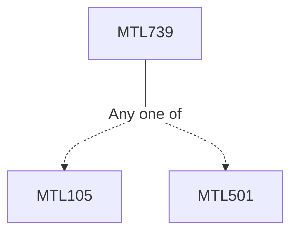

**Credits:** 3 (3-0-0)

**Prerequisites:** [[/Mathematics/MTL105|MTL105]]/[[/Mathematics/MTL501|MTL501]]

#### Description
Revision of basic group theory. Definition and examples of representation. Subrepresentation, sum and tensor product of represenations, irreducible representations; Character Theory: Character of a representation, Schur’s Lemma, Maschke’s theorem, Orthogonality relations for characters, decomposition of regular representation, number of irreducible representations of a group; Representation of subgroups and product of groups, induced representations; Group Algebra: Representations and modules; Decomposition of complex algebra C[G] and Integrability properties of characters. Induced representations, restriction to subgroups, Reciprocity formula, Mackey’s irreducibility criterion; Irreducible representations of symmertric groups (S_n) and alternating groups (A_n).

### Prerequisite Tree

