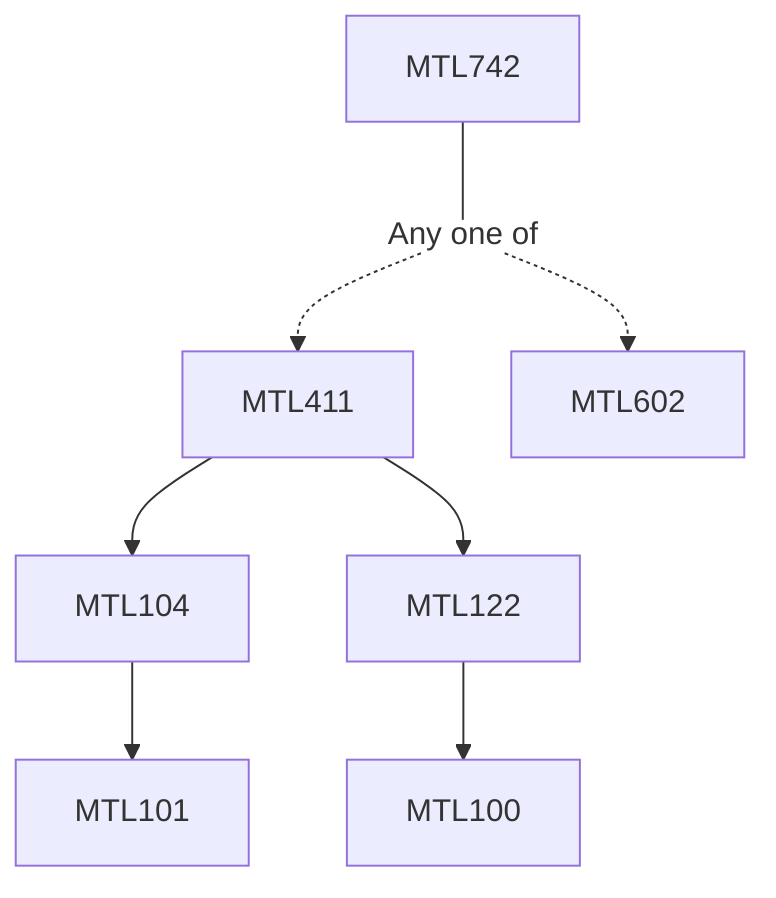

**Credits:** 3 (3-0-0)

**Prerequisites:** [[/Mathematics/MTL411|MTL411]]/[[/Mathematics/MTL602|MTL602]]

#### Description
Weak and weak*-topologies, closed convex sets, weak compactness, Alaoglu’s theorem, locally convex topologies, separation of points by linear functionals, Krein-Milman theorem, Stone-Weierstrass theorem. Normed algebras, resolvent, spectrum, spectral radius, functional calculus, spectral mapping theorem, Gelfand’s theory of commutative Banach algebras.

Basic properties of compact operators, spectral theory of compact operators, Fredholm alternative, General theory of Schatten-von Neumann classes, Hilbert-Schmidt operators, trace and trace duality in finite dimensions, duality for Schatten-von Neumann classes. Functional calculus for self-adjoint operators, square root of positive operators, polar decomposition, some topologies on B(H), spectral measures, the spectral theorem for normal operators.

### Prerequisite Tree

