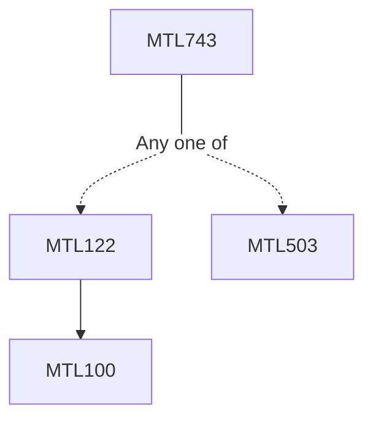

**Credits:** 3 (3-0-0)

**Prerequisites:** [[/Mathematics/MTL122 | MTL122]]/[[/Mathematics/MTL503 | MTL503]]

#### Description 
Fourier Series - Definition, uniqueness, convolution, summability, convergence of Fourier series, Fourier series for square integrable functions, Plancheral theorem, Riesz-Fischer theorem, Gibb’s phenomenon, divergence of Fourier series Applications of Fourier series – Isoperimetric inequality, Weierstrass approximation theorem, Weyl’s equidistribution theorem, heat equation on the circle.

Fourier transform – Schwartz space on R, Fourier transform on the Schwartz space, Fourier transform of integrable and square-integrable functions, Poisson summation formula.

Tempered distributions – Topology on the Schwartz space, tempered distributions and its properties, Fourier transform of tempered distributions.

Applications – Uncertainty principle, Paley-Wiener theorem, Wiener’s theorem, Shannon sampling theorem, multiplier theorem for integrable functions.

### Prerequisite Tree

