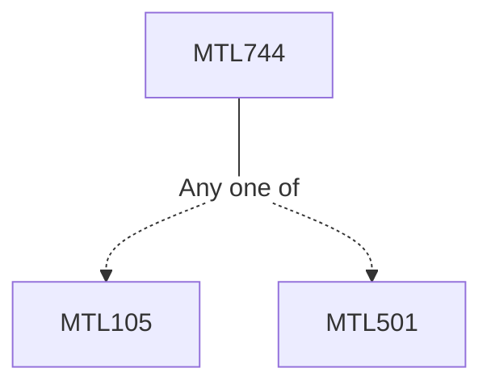

**Credits:** 3 (3-0-0)

**Prerequisites:** [[/Mathematics/MTL105|MTL105]]/[[/Mathematics/MTL501|MTL501]]

**Overlaps with:** ELL710

#### Description
Review of communication channels, maximum likelihood and nearest neighbour decoding schemes, Hamming distance, Distance of a code. Structure of finite fields,Linear codes and their duals, Equivalence of linear codes, encoding with a linear code, decoding of a linear code, ISBN Code, Hamming codes. Hadamard matrix codes, Golay codes, Codes and Latin squares. Non-linear codes, Nordstrom-Robinson code, Kerdock codes, Preparata codes. Bounds in coding theory: Sphere- covering bound, Hamming bound and perfect codes, Singleton bound and MDS codes, Gilbert-Varshamov bound, Plotkin bound, Griesmer bound. Weight enumerators, MacWilliams Identity. Construction of new codes: Propagation rules, Reed-Muller codes, subfield codes.

The structure of cyclic codes, encoding and decoding with a cyclic code, minimal codes, Some special cyclic codes including BCH codes and their decoding algorithm, Reed-Solomon codes, quadratic residue codes. Burst errors, Burst error-correcting codes, decoding of cyclic burst-error-correcting codes. Generalized Reed-Solomon codes, Alternant codes, Goppa codes, Sudan decoding for generalized RS codes.

### Prerequisite Tree

