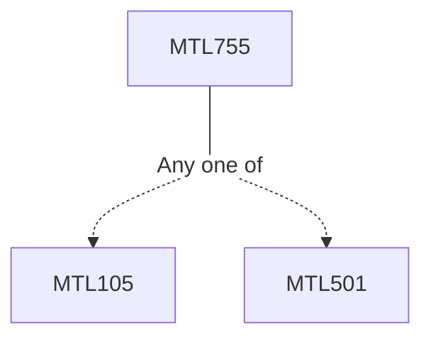

**Credits:** 3 (3-0-0)

**Prerequisites:** [[/Mathematics/MTL105|MTL105]]/[[/Mathematics/MTL501|MTL501]]

#### Description
Rings of polynomials and their quotients, local rings, DVR, modules, free modules, exact sequences. Affine algebraic sets, The Hilbert basis theorem. Hilbert’s Nullstellansatz. Affine varieties: Coordinate rings, polynomial maps, coordinate changes, rational functions. Local Properties of plane curves: Multiple points, tangent lines, multiplicities and local rings, intersection number. Projective varieties: projective algebraic sets, projective plane curves, linear systems of curves, Bezout’s theorem, Max Noether’s fundamental theorem and its applications. Variety, Morphisms and Rational maps: The Zariski topology, varieties and their morphism, dimension of varieties, rational maps. Resolution of sigularies: Blowing up a point in affine and projective planes, quadratic transformations and nonsingular models of curves.

### Prerequisite Tree

