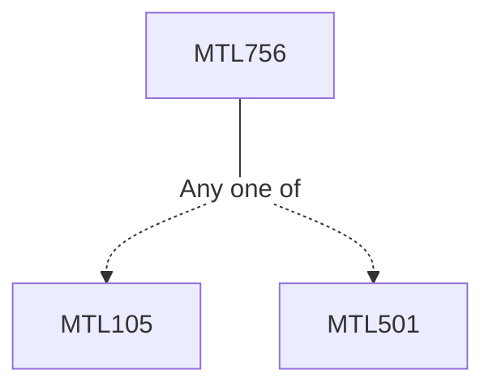

**Credits:** 3 (3-0-0)

**Prerequisites:** [[/Mathematics/MTL105|MTL105]]/[[/Mathematics/MTL501|MTL501]]

**Overlaps with:** MTL856

#### Description
Definition and examples, solvable and nilpotent Lie algebras, the Engel’s theorem, Lie’s theorem, Cartan’s theorem, killing form. Representation theory of finite dimensional semisimple Lie algebras. The Weyl’s theorem, representations of sl(2,C), root space decomposition. Weyl group, Cartan subalgebras and classification of root systems; Definition and examples of matrix Lie groups. Exponential mapping, Baker-Campbell-Hausdorff formula. Representation theory of matrix Lie groups. Representation theory of SU(2) and SU(3).

### Prerequisite Tree

