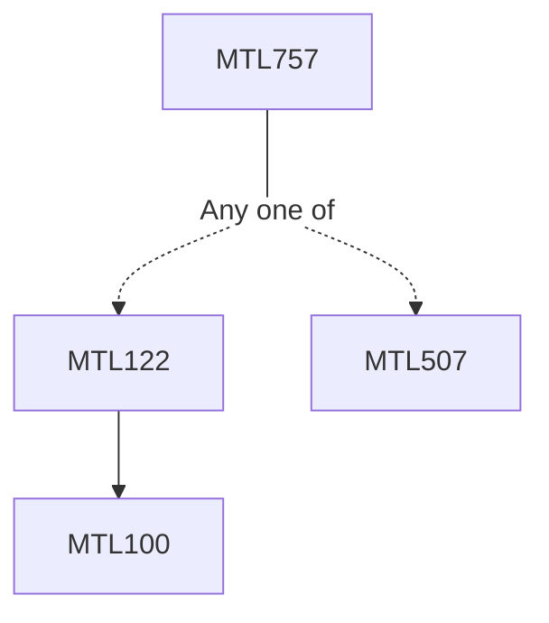

**Credits:** 3 (3-0-0)

**Prerequisites:** [[/Mathematics/MTL122|MTL122]]/[[/Mathematics/MTL507|MTL507]]

#### Description
Homotopy of paths, fundamental group, covering spaces, fundamental group of the circle, Retraction and application, van Kampen theorem and application. Universal cover and classification of covering spaces. Deck transformation and group actions. Simplicial and Singular homology, homotopy invariance, exact sequences- Mayer-Vietories Sequences, the equivalence of simplicial and singular homology.

### Prerequisite Tree

