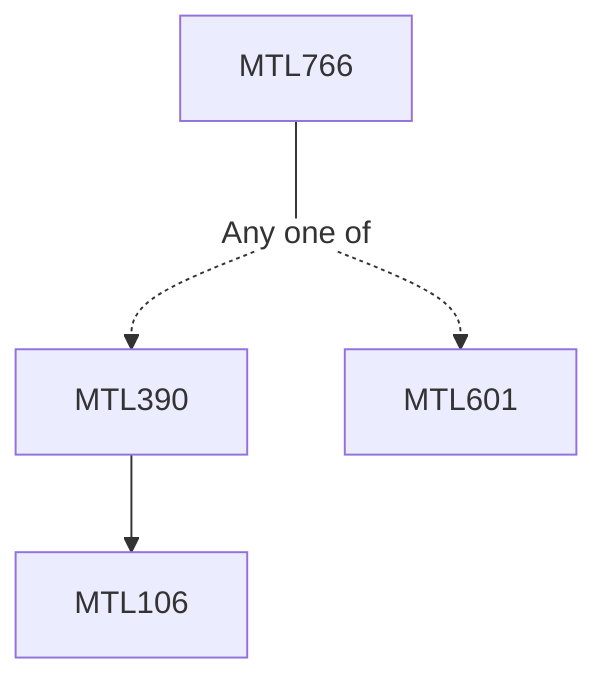

**Credits:** 3 (3-0-0)

**Prerequisites:** [[/Mathematics/MTL390|MTL390]]/[[/Mathematics/MTL601|MTL601]]

#### Description
Introduction to Multivariate data, Geometry of a sample, Mean and Covariance, Generalized Variance; Sample value of Linear combination of variables; Multivariate Normal Distribution, and its properties, Sampling from a Multivariate Normal population, Sampling distribution and Large sample Behaviour of Mean and Covariance, Inference about Mean Vector, Hotelling’s T-square and Likelihood Ratio test, Confidence Region , Comparison of several Multivariate Populations, Multivariate Linear Regression Models, Inferences about regression models and parameters, Model checking, Principal Component Analysis, Introduction to Factor Analysis, Orthogonal Factor Models, Factor Rotation, Strategy for Factor Analysis; Canonical Correlation Analysis, Interpreting population by Canonical variables, Large Sample Inferences.

### Prerequisite Tree

