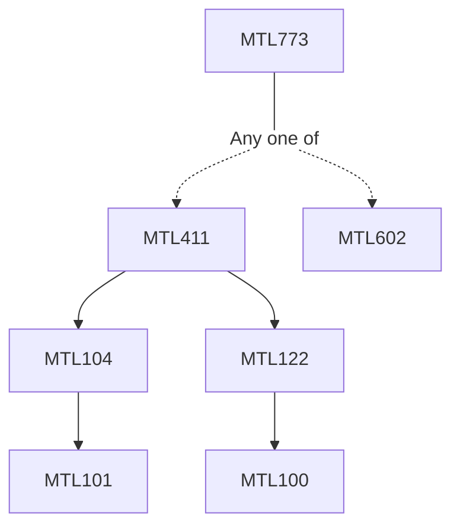

**Credits:** 3 (3-0-0)

**Prerequisites:** [[/Mathematics/MTL411|MTL411]]/[[/Mathematics/MTL602|MTL602]]

#### Description
Basic Fourier Analysis: Fourier Series, convergence of Fourier series, Riesz Fischer theorem, Fourier transform of square integrable functions, Plancheral formula, Poisson Summation formula, Shannon sampling theorem, Heisenberg Uncertainty principle. Continuous Wavelet transform, Plancherel formula, Inversion formulas. Frames, Riesz Systems, discrete wavelet transform, Numerical algorithms. Orthogonal bases of wavelets, multi resolution analysis, smoothness of wavelets, compactly supported wavelets, cardinal spline wavelets. Tensor products of wavelets, Decomposition and reconstruction algorithms for wavelets, wavelet packets, recent development and applications.

### Prerequisite Tree

