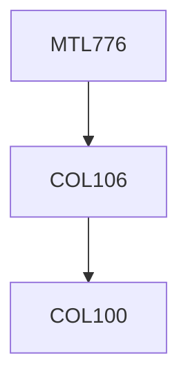

**Credits:** 3 (3-0-0)

**Prerequisites:** [[/Computer Science and Engineering/COL106|COL106]]

**Overlaps with:** MTL768, COL751

#### Description
Introduction to Graphs: Definition and basic concepts, Efficient representations of Graphs; Graph Searching: DFS and BFS; Application of Graph Searching: finding connected components, bi-connected components, testing for bipartiteness, finding cycle in graphs; Trees: Different MST algorithms, enumeration of all spanning trees of a graph; Paths and Distance in Graphs: Single source shortest path problem, All pairs shortest path problem, center and median of a graph, activity digraph and critical path; Hamiltonian Graphs: sufficient conditions for Hamiltonian graphs, traveling Salesman problem; Eulerian Graphs: characterization of Eulerian graphs, construction of Eulerian tour, The Chinese Postman problem; Planar Graphs: properties of planar graphs, planarity testing algorithm; Graph Coloring: vertex coloring, chromatic polynomials, edge coloring, planar graph coloring; Matching: maximum matching in bipartite graphs, maximum matching in general graphs; Networks: The Max-flow min-cut theorem, max-flow algorithm; NP-Complete Graph problems; Approximation algorithms for some NP-Hard graph problems; Algorithms for some NP-Hard graph problems on special graph classes.

### Prerequisite Tree

