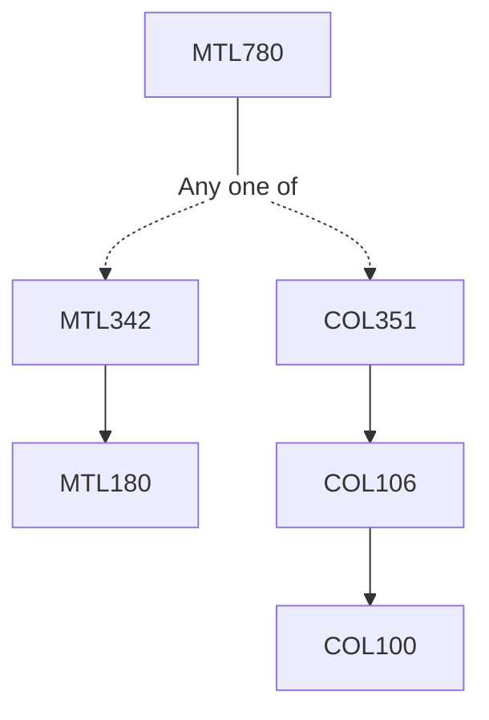

**Credits:** 3 (3-0-0)

**Prerequisites:** [[/Mathematics/MTL342|MTL342]] or [[/Computer Science and Engineering/COL351|COL351]] or equivalent

#### Description
Review of NP-completeness and reductions. Introduction to parameterized complexity, parameterized algorithms through bounded search trees, iterative compression, randomized methods in parameterized algorithms, dynamic programming over subsets, treewidth and parameterized algorithms for bounded treewidth graphs, algebraic techniques in parameterized complexity, Matroids and representative sets, lower bounds for parameterized algorithms based on Exponential Time Hypothesis and Strong Exponential Time Hypothesis.

### Prerequisite Tree

