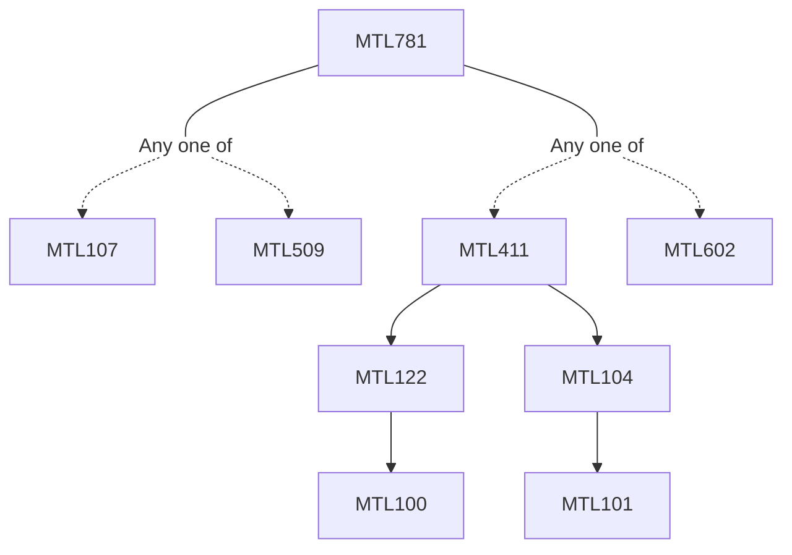

**Credits:** 3 (3-0-0)

**Prerequisites:** [[/Mathematics/MTL107|MTL107]]/[[/Mathematics/MTL509|MTL509]] and [[/Mathematics/MTL411|MTL411]]/[[/Mathematics/MTL602|MTL602]]

#### Description
Variational formulation of elliptic boundary value problems; Lax Milgram Lemma; Existence and uniqueness of solutions; equivalence of Galerkin and Ritz variational formulations; Triangulation of ordinary domains-rectangles, polygons, circles, ellipses, etc. Finite element problems; conforming and non-conforming methods, Ce’a’s Lemma, Interpolation on simplexes in Rn, different Lagrange and Hermite finite elements, Affine, isoparametric, sub-parametric, super parametric finite elements; Triangulation using isoparametric mapping; approximation of boundary; Numerical Integration, construction of element stiffness matrices and assembly into global stiffness matrix, Skyline method of solution of finite element equations; Solution of model problems and computer implementation procedures; Asymptotic error estimate results; Eigenvalue problems of Laplace operator.

### Prerequisite Tree

