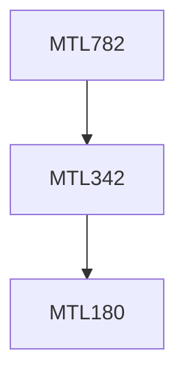

**Credits:** 4 (3-0-2)

**Prerequisites:** [[/Mathematics/MTL342|MTL342]]

#### Description
Introduction to Data Mining, Data Cleaning and transformation,Data synchronization with operational databases, Association rule mining, Sequence analysis, mining complex data, Classification, knowledge Extraction and prediction, LIFT charts and ROC curves, Bagging and Boosting, Clustering techniques and application, Parallel and distributed data mining systems, data cubes and other visualizations.

### Prerequisite Tree

