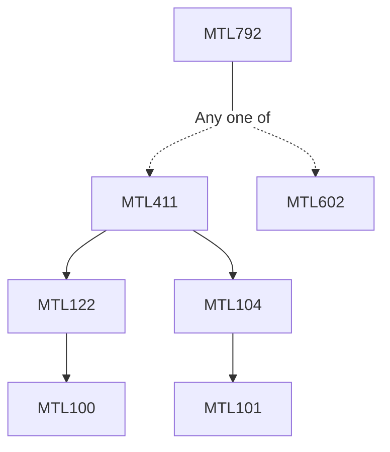

**Credits:** 3 (3-0-0)

**Prerequisites:** [[/Mathematics/MTL411|MTL411]]/[[/Mathematics/MTL602|MTL602]]

#### Description
Review of Lebesgue integration and Classical function spaces, Spaces of infinitely differentiable functions and Holder spaces. Sobolev spaces: L^p spaces, Weak derivatives, Sobolev spaces, approximation to identity, approximation with smooth functions, trace spaces, Sobolev and Poincare inequalities, compact embeddings and negative order Sobolev spaces. Second order elliptic equations: Weak solutions, Lax-Milgram Theorem, Energy estimates, Fredlhom-alternative, Regularity of weak solutions, Maximum principles and eigenvalue problems. Mountain Pass lemma and applications. Hardy’s inequalities and their relation with Elliptic equations. Linear Evolution equations: Second order parabolic equations, existence and regularity of weak solutions, Maximum principles. Semi-group Theory: Generating, contraction semi-groups and applications.

### Prerequisite Tree

