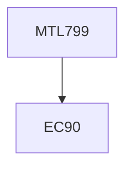

**Credits:** 3 (3-0-0)

**Prerequisites:** 90 Credits at the UG level

#### Description
Review: Normed linear space, Banach space, Hilbert space, Orthonormal basis, Projection theorem, Dual spaces, Riesz representation theorem, Bounded linear operations, compact operators, Spectral theorem for self-adjoint compact operators.

Reproducing Kernel Hilbert Space (RKHS), Positive definite functions, Feature maps, Gaussian Kernel and their RKHSs, Mercer’s theorem, The elements of statistical learning theory, Probabilistic inequalities, Tikhonov-type regularization, General regularization in Hilbert space, Representer theorem, Convergence analysis of empirical risk minimization, Adaptive regularization parameter choice rules.

Approximation by trigonometric polynomials, Localized kernel approximations, Neural Networks, RBF neural networks, universal approximation, Convergence analysis of neural networks, Analysis of Deep vs Shallow, University of deep convolution neural networks, Generative adversarial nets and convergence analysis.

### Prerequisite Tree

