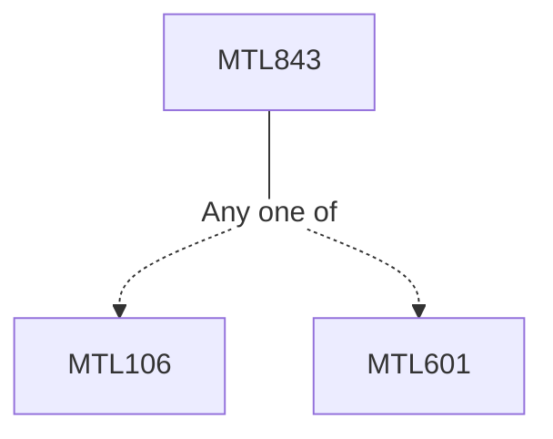

**Credits:** 3 (3-0-0)

**Prerequisites:** [[/Mathematics/MTL106|MTL106]]/[[/Mathematics/MTL601|MTL601]]

#### Description
Review of elementary stochastic calculus and Black - Scholes - Merton theory of option pricing. Corporate liabilities and contingent claims. Risk structure of interest rates. Statistical techniques for analyzing defaults. Credit scoring modeling using logistic regression, Discriminant Analysis and support vector machines. Rating based term structure models. Credit risk and interest rate swaps. Credit default swaps (CDS), collateralized debt obligations (CDO’s) and other related products. The copula approach. Portfolio Credit risk analysis using coherant risk measures.

### Prerequisite Tree

